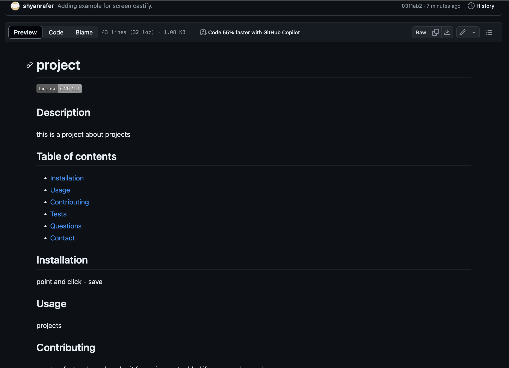
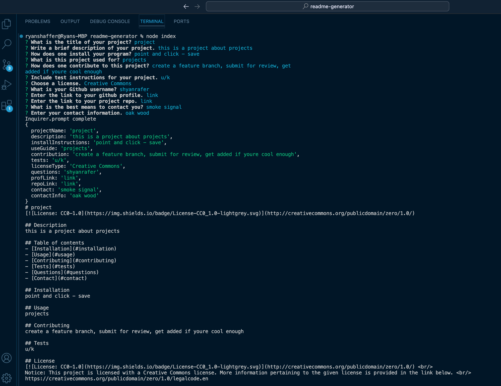
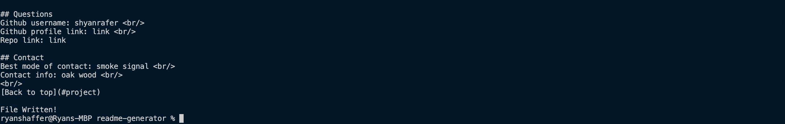

# readme-generator

## User Story
```md
AS A developer
I WANT a README generator
SO THAT I can quickly create a professional README for a new project
```

## Acceptance Criteria
```md
GIVEN a command-line application that accepts user input
WHEN I am prompted for information about my application repository
THEN a high-quality, professional README.md is generated with the title of my project and sections entitled Description, Table of Contents, Installation, Usage, License, Contributing, Tests, and Questions
WHEN I enter my project title
THEN this is displayed as the title of the README
WHEN I enter a description, installation instructions, usage information, contribution guidelines, and test instructions
THEN this information is added to the sections of the README entitled Description, Installation, Usage, Contributing, and Tests
WHEN I choose a license for my application from a list of options
THEN a badge for that license is added near the top of the README and a notice is added to the section of the README entitled License that explains which license the application is covered under
WHEN I enter my GitHub username
THEN this is added to the section of the README entitled Questions, with a link to my GitHub profile
WHEN I enter my email address
THEN this is added to the section of the README entitled Questions, with instructions on how to reach me with additional questions
WHEN I click on the links in the Table of Contents
THEN I am taken to the corresponding section of the README
```

## Challenges and setbacks
I did have a tutor help me sort out the badges aspect of this assignment. The tutor said i need to pseudocode and console.log more often. This will allow me to consider data types and how to accomdate writing those data types thus making the writing easier and faster when time comes to doing so. Also, along the way, I can see the results of my code via console logs. <br/>
There was also a point where I encountered a merge conflict. I was in the zone in regards to writing code and with that had an idea mid commit. I ended up making edits then finished the push afterwards. Before undoing, I quickly copied the edited version, unstaged the commit, rebased to a prior commit, then copy - pasted the edited version, recommitted and then pushed up without problems. 

## Links
Github repo: https://github.com/shyanrafer/readme-generator <br/>
Screencastify video: https://drive.google.com/file/d/1RjcMoWEfJA92prxLRmhJjIDZj-GN9tDT/view

## Screenshots


